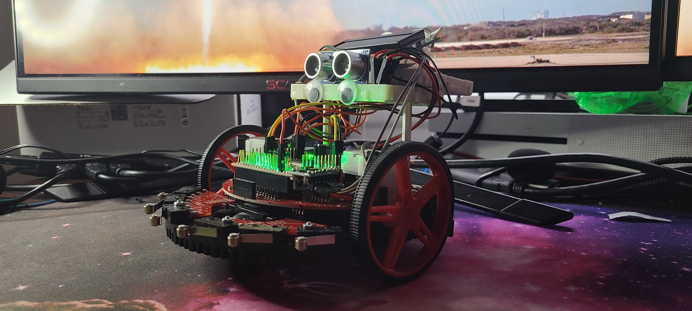
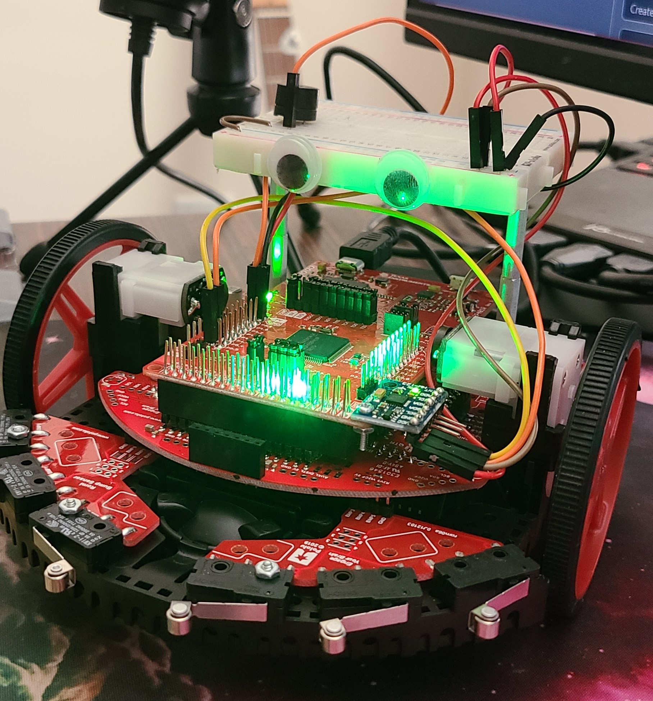

# MARV (Mildly Autonomous Robotic Vehicle)
MARV is being designed and built as a way for me to gain an introdcution to robotics and hopefully make a little robot friend.

## Hardware
As of v0.0.2, MARV uses the following hardware:
- TI RSLK-MAX Robotics kit
- TI MSP432P401R LaunchPad Development board (Arduino)
- MPU-6050 Inertial Measurement Unit
- 6 Forward-Facing Bump Sensors
- 2 DRV8838 Motor Drivers for the 2 DC Motors (with Romi encoders)
- Active Buzzer
- Dual-Nonfunctional Googly Optical Recognition Sensors
- LCD-1602A Display
- HC-SR04 Ultrasonic Sensor

## Software
All of the software is being written in C/C++ using the Energia IDE

## Features

***Note:*** These "versions" are not full updates/releases. They are small incremental updates
that may still include bugs or unfinished components.

***MARV v0.0.2 shown above***

### v0.0.2:
- Added LCD1602A LCD Screen
- Added I2C interface for read/write operations to device registers
- Started implementing LCD API
- Started implementing Motors API for far more precise and dynamic movement functions
- (Ultrasonic sensor) ***NEEDS TO BE FIXED***
- Added collision detection when turning right or left ***NEED TO FIX IN NEW REFACTOR***

***MARV v0.0.1 shown above***

### v0.0.1:
- Forward collision detection
- Collision alert (via onboard LED and active buzzer)
- Morse code communication through LED blinks and buzzer beeps

## Upcoming Updates:
- Collision avoidance
- Follow mode (robot follows the user around)
- Use measurements from IMU to determine orientation in order to get out of a bad spot
- Add oscilating ultrasonic sensor assembly using stepper motor and 3 ultrasonic sensors in a triangle configuration in attempt to create a 3D map of the robot's current environment using ultrasound